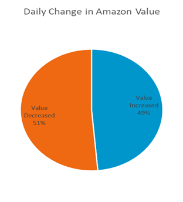
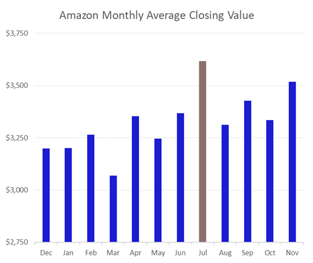
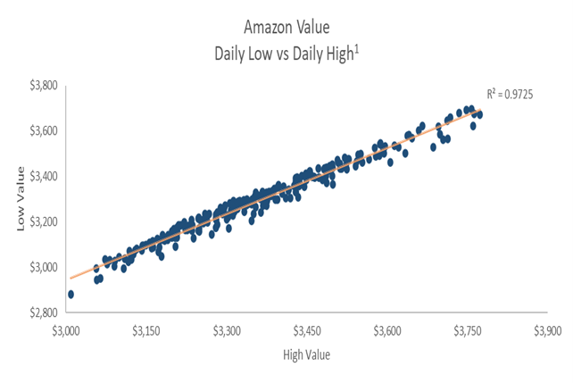
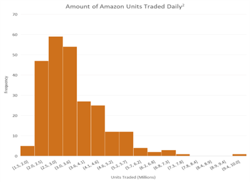
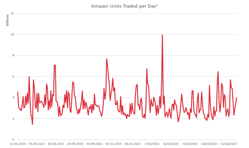
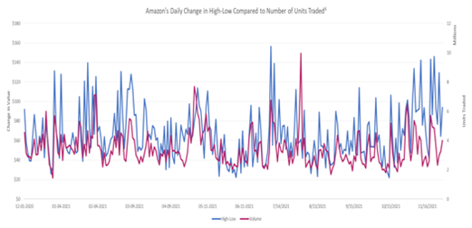

# Amazon Stock Analysis - MS Excel Database

Welcome to the Amazon Stock Analysis project! This repository contains a comprehensive analysis of Amazon's stock performance using historical data from December 2020 to November 2021. Dive into the world of e-commerce giant Amazon.com, Inc. and explore its stock trends, patterns, and insights.

## About Amazon
Amazon.com, Inc. is an American multinational technology company renowned for its pioneering contributions in e-commerce, cloud computing, digital streaming, and artificial intelligence. It stands tall among the Big Five companies in the U.S. information technology industry, alongside Google, Apple, Microsoft, and Facebook. Amazon's influence extends far beyond just the economic realm; it's considered one of the most influential cultural forces globally and holds the prestigious title of the world's most valuable brand.


## About the Dataset
The dataset provided here furnishes historical stock data at the daily level, spanning from December 2020 to November 2021. It comprises the following essential columns:
- **Date**: Date the data was recorded
- **Open**: Price from the first transaction of a trading day
- **High**: Maximum price in a trading day
- **Low**: Minimum price in a trading day
- **Close**: Price from the last transaction of a trading day
- **Volume**: Number of units traded in a day

All monetary values are displayed in USD (United States Dollar).


## Why This Analysis Matters
Understanding Amazon's stock performance is not just about financial analysis; it's a window into the dynamics of one of the most influential companies in modern history. By delving into this dataset, you can:
- **Gain Insights**: Uncover patterns, trends, and anomalies in Amazon's stock behavior.
- **Make Informed Decisions**: Use historical data to inform future investment strategies or business decisions.
- **Learn from the Best**: Amazon's success story is a treasure trove of lessons for entrepreneurs, investors, and business enthusiasts alike.


## How to Use This Repository
1. **Download the Dataset**: Clone or download the repository to access the dataset and analysis files.
    ```bash
    git clone https://github.com/your-username/amazon-stock-analysis.git
    ```

2. **Explore the Analysis**: Dive into the provided Excel database to explore detailed stock analysis, visualizations, and insights.


3. **Contribute**: Feel free to contribute to this project by adding your analysis, improving existing code, or suggesting enhancements.


## Analysis Insights
- On any given day, the company's value is just as likely to increase as it is to decrease.

  


- July 2021 had the highest closing value.
  


  
- There is a very strong linear relationship between the daily High and Low values. As one variable increases/decreases, so does the other. With an R-squared value very close to 1, almost all the variability in one variable can be explained by the variability in the other.


  
- Half of the time, the number of units traded in a day was roughly between 1.5 and 3.0 million and the other half of the time, roughly between 3.0 and 10.0 million units were traded. Usually, 5.7 million or fewer units were traded in a day but one day in the year saw as many as 10 million units traded.


  
- Maximum trading occurred on 30th July 2021 with approximately 9.96 million units traded that day. Minimum trading occurred on 24th December 2020 with approximately 1.45 million units traded that day. There does not seem to be any particular pattern with respect to the number of units being traded throughout the year. Most days see the trading of between 2 and 6 million units. The number of Amazon units traded dropped from 9.96 million to 2.18 million from 30th July 2021 to 4th August 2021.


  
- Although it's not always perfect, there does appear to be a relationship between the daily High-Low difference and the number of units traded. Loosely speaking, when the High-Low difference is larger, more units are traded. Conversely, when the High-Low difference is smaller, fewer units are traded.



